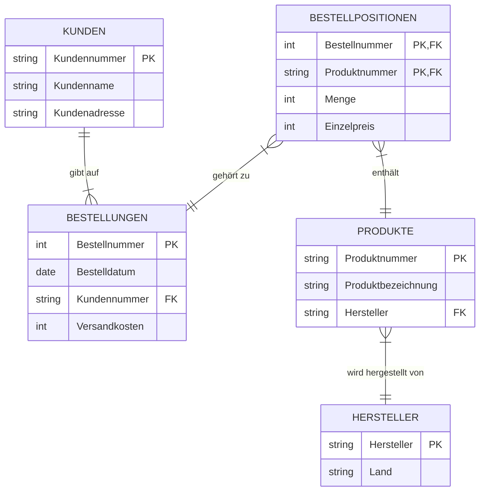

# Datenbank-Diagramm

```mermaid
erDiagram
    BESTELLUNGEN {
        int Bestellnummer PK
        date Bestelldatum
        string Kundennummer FK
        int Versandkosten
    }
    KUNDEN {
        string Kundennummer PK
        string Kundenname
        string Kundenadresse
    }
    PRODUKTE {
        string Produktnummer PK
        string Produktbezeichnung
        string Hersteller FK
    }
    HERSTELLER {
        string Hersteller PK
        string Land
    }
    BESTELLPOSITIONEN {
        int Bestellnummer PK, FK
        string Produktnummer PK, FK
        int Menge
        int Einzelpreis
    }

    KUNDEN ||--|{ BESTELLUNGEN : "gibt auf"
    PRODUKTE }|--|| HERSTELLER : "wird hergestellt von"
    BESTELLPOSITIONEN }|--|| PRODUKTE : "enthält" 
    BESTELLPOSITIONEN }|--|| BESTELLUNGEN : "gehört zu"
    
```