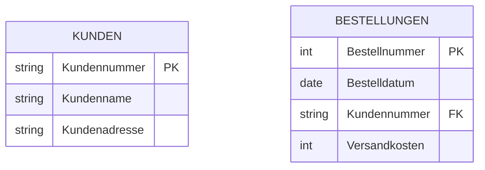

# Datenbank-Diagramm

```mermaid
erDiagram
    KUNDEN {
        string Kundennummer PK
        string Kundenname
        string Kundenadresse
    }
    BESTELLUNGEN {
        int Bestellnummer PK
        date Bestelldatum
        string Kundennummer FK
        int Versandkosten
    }
    

    %% HERSTELLER, PRODUKTE,
    %% BESTELLPOSITIONEN 
```